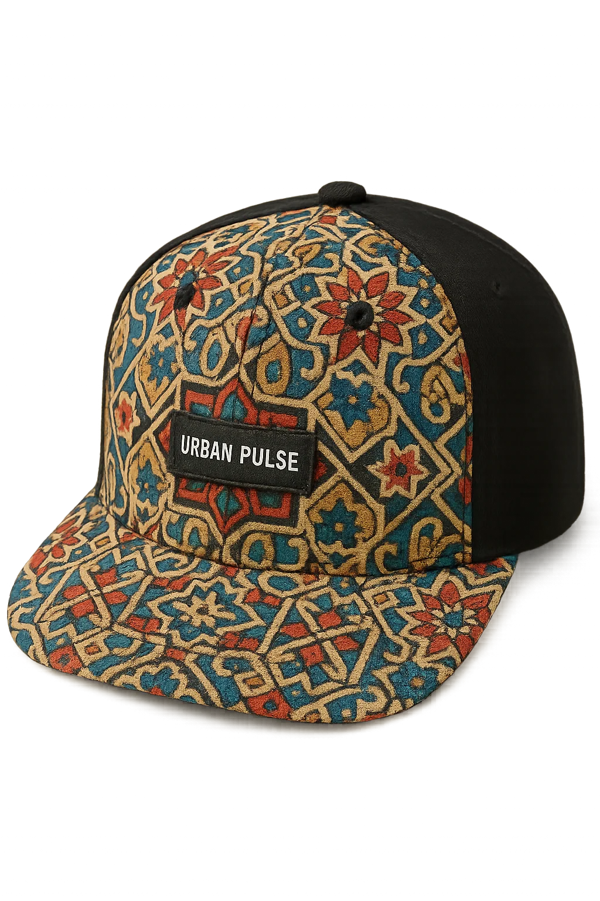
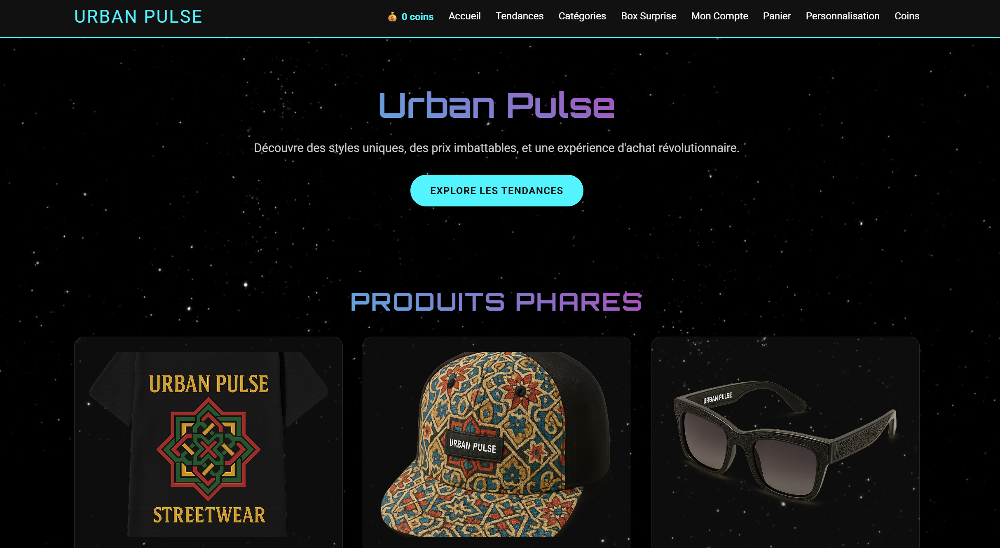
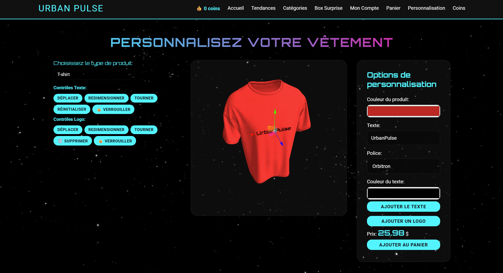
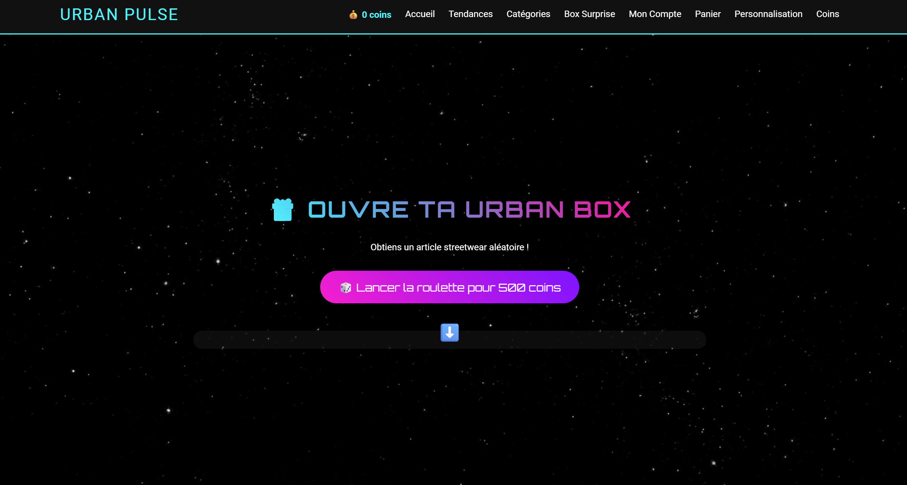

<p align="center">
  
</p>

<h1 align="center">🛒 Urban Pulse</h1>

<p align="center">
  <strong>Le Shopping du Futur</strong> — Une plateforme e-commerce streetwear avec personnalisation 3D, système de coins et box surprise.
</p>

<p align="center">
  
  
  
  
  
  
</p>

---

## 📸 Aperçu

<p align="center">
  
  &nbsp;&nbsp;
  
</p>

<p align="center">
  
</p>

---

## ✨ Fonctionnalités

| Fonctionnalité             | Description                                                                   |
| -------------------------- | ----------------------------------------------------------------------------- |
| 🏠 **Vitrine**             | Page d'accueil avec produits phares et navigation fluide                      |
| 🔥 **Tendances**           | Catalogue de produits streetwear tendance                                     |
| 📂 **Catégories**          | Navigation par catégorie : vêtements haut, pantalons, chaussures, accessoires |
| 🎨 **Personnalisation 3D** | Customise ton t-shirt en temps réel avec Three.js et Fabric.js                |
| 🎁 **Box Surprise**        | Roulette pour gagner des articles aléatoires avec des coins                   |
| 💰 **Système de Coins**    | Gagne 10% de cashback en coins sur chaque commande                            |
| 🛒 **Panier**              | Ajout, suppression, calcul TPS/TVQ automatique                                |
| 👤 **Espace Compte**       | Inscription, connexion, gestion d'adresse, historique                         |

---

## 🏗️ Architecture du Projet

```
shopping-site/
├── index.html                 ← Point d'entrée
│
├── api/                       ← Backend REST (PHP + PDO)
│   ├── config/database.php    ← Connexion MySQL unique
│   ├── middleware/auth.php     ← Authentification par sessions
│   ├── auth/                  ← Login, Register, Logout
│   ├── cart/                  ← Ajout, Lecture du panier
│   ├── orders/                ← Validation de commande
│   ├── user/                  ← Profil, Adresse
│   └── coins/                 ← Gestion des coins
│
├── assets/
│   ├── css/                   ← 10 fichiers CSS modulaires
│   ├── js/                    ← 11 fichiers JS (navbar, coins, tendances...)
│   └── media/                 ← Vidéos et images promotionnelles
│
├── pages/                     ← Pages HTML
│   ├── login.html
│   ├── register.html
│   ├── account.html
│   ├── cart.html
│   ├── trends.html
│   ├── categories.html
│   ├── product.html
│   ├── customize.html
│   ├── box.html
│   ├── coins.html
│   └── categories/            ← Sous-pages par catégorie
│       ├── vetements-haut.html
│       ├── pantalon.html
│       ├── chaussures.html
│       └── accessoires.html
│
├── database/
│   └── schema.sql             ← Schéma SQL complet (5 tables)
│
├── clothes/                   ← Images des produits
├── models/                    ← Modèles 3D (GLTF)
└── sounds/                    ← Fichiers audio
```

---

## 🛠️ Technologies

- **Frontend** : HTML5, CSS3 (variables CSS, animations), JavaScript vanilla
- **Backend** : PHP 8+ avec PDO (requêtes préparées)
- **Base de données** : MySQL / MariaDB (InnoDB, utf8mb4)
- **3D** : Three.js v0.129.0 + OrbitControls + GLTFLoader
- **Customisation** : Fabric.js 4.5.0 (texte sur texture)
- **Serveur** : XAMPP (Apache + MySQL)

---

## 🚀 Installation

### Prérequis

- [XAMPP](https://www.apachefriends.org/) installé sur votre machine

### Étapes

1. **Cloner le repo**

   ```bash
   git clone https://github.com/VOTRE-USERNAME/urban-pulse.git
   ```

2. **Copier dans XAMPP**

   ```bash
   cp -r urban-pulse/shopping-site C:/xampp/htdocs/shopping-site
   ```

3. **Démarrer XAMPP**
   - Ouvrir XAMPP Control Panel
   - Cliquer **Start** sur **Apache**
   - Cliquer **Start** sur **MySQL**

4. **Importer la base de données**

   ```bash
   mysql -u root < C:/xampp/htdocs/shopping-site/database/schema.sql
   ```

   Ou via **phpMyAdmin** → Importer → `database/schema.sql`

5. **Ouvrir dans le navigateur**
   ```
   http://localhost/shopping-site/
   ```

---

## 🗄️ Base de Données

| Table               | Description                                                      |
| ------------------- | ---------------------------------------------------------------- |
| `users`             | Comptes utilisateurs (email, mot de passe hashé, coins, adresse) |
| `cart`              | Panier par utilisateur                                           |
| `orders`            | Commandes validées                                               |
| `order_items`       | Articles de chaque commande                                      |
| `coin_transactions` | Historique des transactions de coins                             |

---

## 🔒 Sécurité

- Mots de passe hashés avec `password_hash()` (bcrypt)
- Requêtes préparées PDO (protection SQL injection)
- Authentification par sessions PHP (pas de localStorage)
- Validation côté serveur sur tous les endpoints
- Verrouillage `FOR UPDATE` sur les transactions de coins

---

## 👨‍💻 Auteur

**Derek** — Projet réalisé dans le cadre du cours 6S

---

<p align="center">
  <sub>⚡ Built with passion and streetwear vibes ⚡</sub>
</p>
